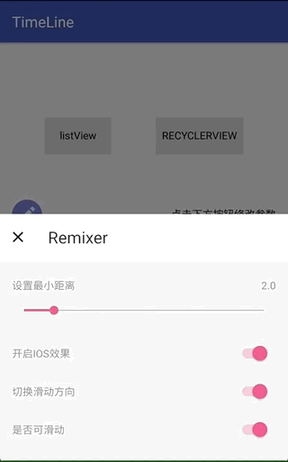
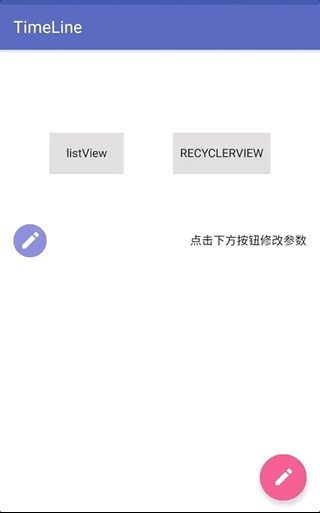

# TimeLine


> 提供了仿IOS的越界回弹效果和左右滑动功能，可自由设置最小滑动距离和是否开启滑动功能

示例：[demo.apk](apk/timeline.apk)

#### Download
    compile 'com.ditclear:swipedraglayout:1.0.0'

#### 截图

					

					


### Feature

- [SwipeDragLayout](https://github.com/vienan/TimeLine/blob/master/swipelayout/src/main/java/com/ditclear/swipelayout/SwipeDragLayout.java)使用ViewDragHelper来进行滑动操作，代码少，易理解，核心代码不过150行
- 使用了保留一个静态类的方法来确保只有一个展开，并在`onDetachedFromWindow`方法中进行关闭操作
- 提供了多种自定义属性，见下表
- [sample](https://github.com/ditclear/SwipeLayout/blob/8d5cfdce76249150b3c37c72cd0a600138fe00d8/app/src/main/java/vienan/app/expandableswipelistview/RecyclerActivity.java)使用了DataBinding和kotlin 进行了多类型的绑定，对于了解和使用DataBinding大有益处，添加多种Type更是十分简单,再也不用extends RecyclerView.Adapter了，可以参考[BindingListAdapter](https://github.com/ditclear/BindingListAdapter)


#### 自定义属性

| attr            |  type   | default |          meaning          |
| --------------- | :-----: | ------: | :-----------------------: |
| need_offset     |  float  |    0.2f |         最小需要滑动的比例         |
| ios             | boolean |    true |         拖动越界回弹效果          |
| swipe_enable    | boolean |    true |           开启滑动            |
| swipe_direction |  enum   |    left | 滑动方向,默认1是左滑left，2为右滑right |

#### 示例

```xml
 <com.ditclear.swipelayout.SwipeDragLayout
                android:id="@+id/swip_layout"
                android:layout_width="match_parent"
                android:layout_height="60dp"
                app:swipe_direction="left"
                app:swipe_enable="true"
                app:ios="true">

            <LinearLayout
                    android:id="@+id/content_layout"
                    android:layout_width="match_parent"
                    android:layout_height="60dp"
                    android:background="#ffffff"
                    android:gravity="center_vertical"
                    android:orientation="horizontal"
                    android:tag="content">

                <ImageView
                        android:id="@+id/iv_type"
                        android:layout_width="40dp"
                        android:layout_height="40dp"
                        android:layout_marginLeft="@dimen/activity_horizontal_margin"
                        android:background="@drawable/type_edit"
                        android:scaleType="centerInside"
                        android:onClick="@{(v)->presenter.onItemClick(v,item)}"
                        android:src="@mipmap/edit"/>

                <TextView
                        android:id="@+id/tv_title"
                        android:layout_width="match_parent"
                        android:layout_height="match_parent"
                        android:ellipsize="end"
                        android:gravity="center_vertical|right"
                        android:maxLines="1"
                        android:paddingRight="@dimen/activity_horizontal_margin"
                        android:onClick="@{(v)->presenter.onItemClick(v,item)}"
                        android:text="@{item.content}"
                        android:textColor="#000000"
                        tools:text="this is content"/>
            </LinearLayout>

            <LinearLayout
                    android:id="@+id/menu_layout"
                    android:layout_width="wrap_content"
                    android:layout_height="wrap_content"
                    android:orientation="horizontal"
                    android:tag="menu">

                <ImageView
                        android:id="@+id/trash"
                        android:layout_width="70dp"
                        android:layout_height="60dp"
                        android:background="#FF6347"
                        android:paddingLeft="25dp"
                        android:onClick="@{(v)->presenter.onItemClick(v,item)}"
                        android:paddingRight="25dp"
                        android:src="@mipmap/trash"/>

                <ImageView
                        android:id="@+id/star"
                        android:layout_width="70dp"
                        android:layout_height="60dp"
                        android:background="#4cd964"
                        android:paddingLeft="22dp"
                        android:paddingRight="22dp"
                        android:onClick="@{(v)->presenter.onItemClick(v,item)}"
                        android:src="@mipmap/star"/>
            </LinearLayout>
        </com.ditclear.swipelayout.SwipeDragLayout>
```

> 注意

暂时只支持两个子View，一个content，一个侧滑的menu，以后会支持

#### 回调监听

```java
    public interface SwipeListener {

        /**
         * 拖动中，可根据offset 进行其他动画
         * @param layout
         * @param offsetRatio  偏移相对于menu宽度的比例
         * @param offset 偏移量px
         */
        void onUpdate(SwipeDragLayout layout, float offsetRatio, float offset);

        /**
         * 展开完成
         * @param layout
         */
        void onOpened(SwipeDragLayout layout);

        /**
         * 关闭完成
         * @param layout
         */
        void onClosed(SwipeDragLayout layout);
    }
```


